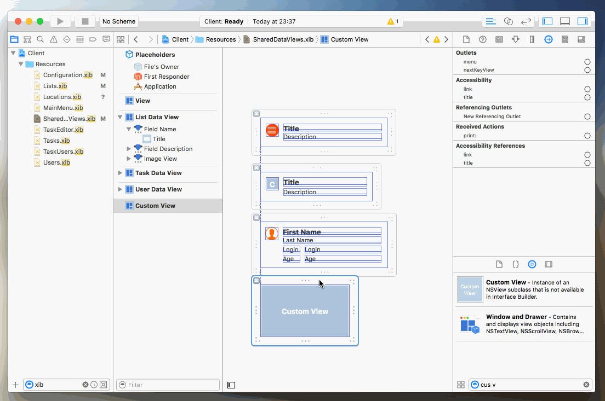
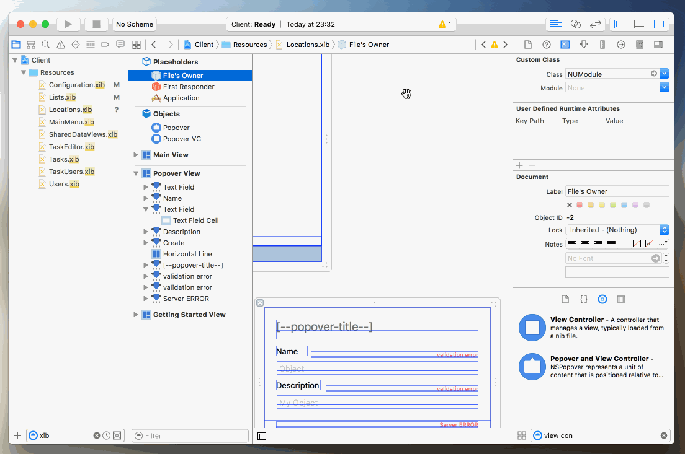
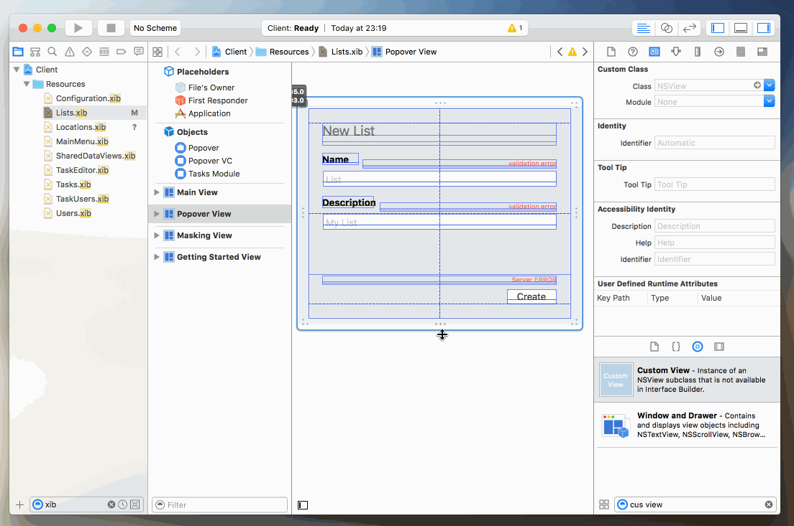

# Monolithe Stack Example

This repository contains a ready to use example of the entire Monolithe Stack. This example contains everything you need to build a ToDo List application from the specifications, up to the client.


## Prerequisites

You need [Docker](https://docs.docker.com/engine/installation/).

Fork this repository:

    $ open https://github.com/nuagenetworks/monostack-example/fork

Clone your fork on your machine:

    $ git clone --recursive https://github.com/[your-github-username]/monostack-example.git
    $ cd monostack-example

Create a Python virtual environment:

    $ virtualenv /tmp/monostack && source /tmp/monostack/bin/activate

Install these two Python packages:

    $ pip install git+https://github.com/nuagenetworks/bambou.git
    $ pip install git+https://github.com/nuagenetworks/monolithe.git

Pull the docker following images:

    $ docker pull monolithe/garuda
    $ docker pull monolithe/specsdirector-client
    $ docker pull monolithe/specsdirector-server

Get a GitHub Token:

    $ open https://github.com/settings/tokens/new

Leave all the default values, click on `generate`. Copy the token somewhere (**you won't be able to see it again if you close the page**).


## Install and run the Monolithe Specifications Director

Get the docker-compose file for the Specifications Director:

    $ curl -o specifications-director.yml https://raw.githubusercontent.com/nuagenetworks/specifications-director/master/docker-compose.yml

Start the Specifications Director:

    $ docker-compose -f specifications-director.yml up -d

Now, you should be able access the specifications director:

    $ open https://$(docker-machine ip)

There is no authentication enabled. You can log in with any couple of login/password. The server field needs to be:

    $ echo https://$(docker-machine ip):1984
    https://192.168.99.100:1984


 Log into the Specifications Director  click on the top right gear icon, click on the `+` button, enter:
- Name: `GitHub` (or whatever you like)
- Value: `[your-github-token]`

Then click on `Create`. Then click on the back button, at the top right corner, to leave the configuration view.

Click on the `+` button to add a new repository and enter the following values:

- Name: `TDLDK` (or whatever you like)
- GitHub API URL: `https://api.github.com`
- Github Repository: `[your-github-username]` / `monostack-example` @`mater`
- Path to Specifications: `Specifications`
- Token: click on the paper clip to associate your GitHub Token

Click save and it will create the new Repository. Select it. As this is the first time, the repository will be pulled. When the job is done, you will see the representation of all the Specifications present in `https://github.com/[your-github-username]/monostack-example/tree/master/Specifications`.

## Improve the specifications with the Specification Director

The current Specifications describe a simple ToDo list. It has some users and some *Lists* at the root level. *Lists* have some *Tasks*, and *Users* can be associated to a particular *Task*.

Now we want to add a new object top level api *Locations* that will have a required `name` and an `address` as attributes. Then we want to be able to associate one (and only one) *Location* to a *List*.

### Create a Location Specification

- Select your `TDLDK` Repository.
- Click on the `+` button at the bottom of the list of Specifications to create a new specification. Enter the following:
    - ReST Name: `location`
    - Resource Name: `locations` (should be auto populated)
    - Entity Name: `Location` (should be auto populated)
    - Root API Specification: not checked (default)

Click on `Create`.

### Create a the attributes for Location

Select the newly created *Location* specification. Select the `Attributes` tab, then click the `+` button to add a new attribute. Enter the following values:

- Name: `address`
- Description: `The address of the location.`

Click `Create`. Create a second one:

- Name: `name`
- Description: `The name of the location.`

Click `Create`.

Now select the newly created `name` attribute, and on the right hand editor, scroll down to find and enable the checkbox `required`. Then click on the `Update` button at the bottom.

### Attach it to the root API

On the Specifications, select the one named `root`. Then select the tab `Children APIs`. Click the `+` button to add a new children API:

- Relationship Type: `Parent/Child relationship`
- Specification: Click on the paper clip to select the newly created `location` specification
- Operations (all default):
    - Allow Retrieval: checked
    - Allow Creation: checked
    - Allow Bulk Creation: not checked
    - Allow Bulk Modification: not checked
    - Allow Bulk Deletion: not checked

Then click the `Create` button


### Add the association key to the existing list specification

Select the existing *list* specification in the Specifications list, then go the the Attribute part. Add a new attribute:

- Name: `associatedLocationID`
- Description: `ID of the associated location.`

Then click `Update`.


### Check what you just did on GitHub

Every action you did created a commit on GitHub. This allows to have a really cool workflow as you will be able to open pull requests, and review your specifications with the rest of your team. You check that out, Click on the button `GitHub`, on the top right corner to get open the page, then look at the commit list.

We didn't do any fork, or branching here, but in a normal scenario, you should. Multiple people can work on a part of the specs, then open pull requests that will be merged into the master. You can then click on the `Synchronize` button to pull the latest changes. If you are working on a fork, the Specifications Director will also merge back the upstream's master branch right into your development branch when you click the `Synchronize` button.

Life is good!


## TodoList

Now let's put all of this on the side for now. The monostack-example repository already contains the code for the client and the server that are implementing the ToDoList application. Let's pull our latest changed in the API

    $ git pull

Now you should see a `location.spec` in the Specification folder.


### Server

The backend is a Garuda based library. Garuda is an application server that will provide for basically everything you need to run your applications based on Monolithe Specifications. You normally just need to write your custom business logic. Everything else is automatic. It relies on some Monolithe SDK. Here we'll generate a sdk based the todo list specifications and inject it into out server.

Generate the Python SDK:

    $ monogen --folder Specifications --language python

The generated code will be available in `codegen/python`.

Create an egg from the generated code:

    $ cd codegen/python && python setup.py sdist && cd -

Then copy the package where our Dockerfile expects it to be:

    $ cp codegen/python/dist/tdldk-1.0.tar.gz Server

Finally let's build and start the ToDoList server:

    $ cd Server && docker build -t tdlserver . && docker-compose up -d && cd -

Your server is now up and running. As we want to ensure that everything is working correctly, we'll use the cli provided by the generated sdk. So let's install our generated python package on our local machine:

    $ pip install --upgrade server/tdldk-1.0.tar.gz

You can give the `tdl` several arguments to pass your credentials and api url. You can also use environment variables which makes it easier. Take a look at the `Tools/rc` file. It exports some variables so we don't have to pass them manually. To use this, run:

    $ source Tools/rc

Then the `tdl` command will be available. You can check the objects it manages by simply doing:

    $ tdl objects
    [Success] 4 objects found.
    +-----------+
    | Name      |
    |-----------|
    | lists     |
    | locations |
    | tasks     |
    | users     |
    +-----------+

We can now create a list:

    $ tdl create list -p name="My First List" description="Very cool list indeed"
    [Success] list has been created with ID=56f61a853b959c0017344cec
    +----------------------+--------------------------+
    | description          | Very cool list indeed    |
    | associatedLocationID |                          |
    | parentType           |                          |
    | lastUpdatedDate      | 1458969221.02            |
    | parentID             |                          |
    | owner                | root                     |
    | creationDate         | 1458969221.02            |
    | ID                   | 56f61a853b959c0017344cec |
    | name                 | My First List            |
    +----------------------+--------------------------+

Or a location:

    $ tdl create location -p name="Nuage Networks" address="380 N Bernardo Ave, Mountain View, CA 94043"
    [Success] location has been created with ID=56f61a943b959c0011344cec
    +-----------------+---------------------------------------------+
    | name            | Nuage Networks                              |
    | parentID        |                                             |
    | parentType      |                                             |
    | lastUpdatedDate | 1458969236.99                               |
    | address         | 380 N Bernardo Ave, Mountain View, CA 94043 |
    | owner           | root                                        |
    | creationDate    | 1458969236.99                               |
    | ID              | 56f61a943b959c0011344cec                    |
    +-----------------+---------------------------------------------+

You can get a more machine friendly output using the `--json` option:

    $ tdl list locations --json
    [
        {
            "name": "Nuage Networks",
            "parentID": null,
            "parentType": null,
            "lastUpdatedDate": 1458969236.0,
            "address": "380 N Bernardo Ave, Mountain View, CA 94043",
            "owner": "root",
            "creationDate": 1458969236.0,
            "ID": "56f61a943b959c0011344cec"
        }
    ]

As you can see, the exact same Monolithe generated SDK is used by the backend to handle the model CRUD operations, as well as a client library and a cli for you to interact with the backend.


### Client

> You need Xcode to work on the UI. It is also preferable that you understand Cappuccino or Cocoa. The goal of this tutorial is not explain how Cappuccino work. If you don't know Cappuccino or should you need more information, please visit http://cappuccino-project.org. Cappuccino rocks!

> You also need to manage this project with XcodeCapp.

Let's see about the client. You will need Cappuccino to be installed in order to have this to work. To install it:

    $ export CAPP_BUILD="/tmp/cappbuild"
    $ cd Client && ./buildApp --cappuccino --cappinstalldir=/tmp/narwhal
    $ export PATH="/tmp/narwhal/bin:$PATH"

> if you already have cappuccino installed, be sure to be on the latest master. You can simply go to `Client/Libraries/Cappuccino` and run `jake install` from here.

Let's build the rest of the libraries.

    $ git submodule update --init # just in case you missed the --recursive during clone :)
    $ ./buildApp -L

Now, let's generate the Model source code with Monolithe and put it where it should be:

    $ cd ..
    $ monogen -f Specifications --language objj
    $ mkdir Client/Models && cp -a codegen/objj/* Client/Models
    $ cd Client

Open a new Terminal window to serve the local directory:

    $ python -m SimpleHTTPServer

Come back to your main terminal, and access the UI:

    open http://127.0.0.1:8000

You can log in using any credentials, but if you want to see the list and location you created before, the user name needs to be `root` as this is the one that is defined in the `Tools/rc`, so the created objects belongs to that user. The server address should be:

    $ echo https://$(docker-machine ip):3000
    https://192.168.99.100:3000

Now you can play around the UI and see how everthing work fine :).

One thing you'll notice is that there is nowhere the new location can be found. That's because we are going to add the needed code to build the UI for the *location* object.

We want to add the location UI in the configuration panel, near the *Users*. So let's Start

#### The Data View

We need a data view to display the location. NUKit provides a code template for it, so let's use it:

    $ cp Libraries/NUKit/Tools/Templates/SourceCode/DataView.j DataViews/SKLocationDataView.j

It also provide a tool to generate the needed import file:

    $ cd DataViews && ../Libraries/NUKit/Tools/genimp -r && cd -

Now you will see that the content of `DataViews/DataViews.j` has been updated. Now we need to edit `DataViews/SKLocationDataView.j` and make it look like:

```objj
@import <Foundation/Foundation.j>
@import <NUKit/NUAbstractDataView.j>


@implementation SKLocationDataView : NUAbstractDataView
{
    @outlet CPTextField fieldAddress;
    @outlet CPTextField fieldName;
}

- (void)bindDataView
{
    [super bindDataView];

    [fieldAddress bind:CPValueBinding toObject:_objectValue withKeyPath:@"address" options:nil];
    [fieldName bind:CPValueBinding toObject:_objectValue withKeyPath:@"name" options:nil];
}

- (id)initWithCoder:(CPCoder)aCoder
{
    if (self = [super initWithCoder:aCoder])
    {
        fieldAddress = [aCoder decodeObjectForKey:@"fieldAddress"];
        fieldName = [aCoder decodeObjectForKey:@"fieldName"];
    }

    return self;
}

- (void)encodeWithCoder:(CPCoder)aCoder
{
    [super encodeWithCoder:aCoder];

    [aCoder encodeObject:fieldAddress forKey:@"fieldAddress"];
    [aCoder encodeObject:fieldName forKey:@"fieldName"];
}

@end
```

Then we need prepare the data views loader and add one outlet for this new data view. Edit `DataViews/DataViewLoader.j` and make it look like:

```objj
@import <Foundation/Foundation.j>
@import <NUKit/NUAbstractDataViewsLoader.j>

@import "DataViews.j"


@implementation DataViewsLoader : NUAbstractDataViewsLoader
{
    @outlet SKListDataView      listDataView     @accessors(readonly);
    @outlet SKLocationDataView  locationDataView @accessors(readonly); // added our new data view here
    @outlet SKTaskDataView      taskDataView     @accessors(readonly);
    @outlet SKUserDataView      userDataView     @accessors(readonly);
}

@end
```

Finally we need to edit `Resources/SharedDataViews.xib` to add a new view:

- Drop a new custom view
- Set its class name to be SKLocationDataView
- Add one text field, and connect it to the data view's `fieldName` outlet
- Add another text field, and connect it to the data view's `fieldAddress` outlet
- connect the newly created data view to the File's Owner `locationDataView` outlet.




#### The Location Module

We need a module to manage the list of *Locations*. Again, let's use the templates:

    $ cp Libraries/NUKit/Tools/Templates/SourceCode/Module.j ViewControllers/SKLocationsModule.j
    $ cp Libraries/NUKit/Tools/Templates/XIBs/LeafModule.xib Resources/Locations.xib
    $ cd ViewControllers && ../Libraries/NUKit/Tools/genimp -r && cd -

Now edit the `ViewControllers/SKLocationsModule.j` and make it look like:

```objj
@import <Foundation/Foundation.j>
@import <NUKit/NUModule.j>
@import "../Models/Models.j"


@implementation SKLocationsModule : NUModule

+ (CPString)moduleName
{
    return @"Locations";
}

- (void)viewDidLoad
{
    [super viewDidLoad];

    [self registerDataViewWithName:@"locationDataView" forClass:SKLocation];
}

- (void)configureContexts
{
    var context = [[NUModuleContext alloc] initWithName:@"Location" identifier:[SKLocation RESTName]];
    [context setPopover:popover];
    [context setFetcherKeyPath:@"childrenLocations"];
    [self registerContext:context forClass:SKLocation];
}

- (BOOL)shouldManagePushOfType:(CPString)aType forEntityType:(CPString)entityType
{
    return entityType === [SKLocation RESTName];
}

- (BOOL)shouldProcessJSONObject:(id)aJSONObject ofType:(CPString)aType eventType:(CPString)anEventType
{
    return aType === [SKLocation RESTName];
}

@end
```

We said that we want to display this module at the same level than the *Users* module. The *Users* module is actually a sub module of the principal module `ViewControllers/SKConfigurationModule.j`. So let's edit this file and make it look like:

```objj
@import <Foundation/Foundation.j>
@import <NUKit/NUModule.j>
@import "../Models/Models.j"

@global SKUsersModule
@global SKLocationsModule


@implementation SKConfigurationModule: NUModule
{
    @outlet CPButton            buttonBack @accessors(readonly);

    @outlet SKLocationsModule   locationsModule; // we add our new module here
    @outlet SKUsersModule       usersModule;
}


#pragma mark -
#pragma mark Initialization

+ (CPString)moduleName
{
    return @"Configuration";
}

+ (CPImage)moduleIcon
{
    return CPImageInBundle(@"toolbar-configuration.png");
}

+ (BOOL)isTableBasedModule
{
    return NO;
}

- (void)viewDidLoad
{
    [super viewDidLoad];

    [viewTitleContainer setBackgroundColor:NUSkinColorBlack];
    [viewTitleContainer setBorderBottomColor:nil];

    [self setSubModules:[usersModule, locationsModule]]; // and we add it to the list of submodules.
}

@end
```

We now need to edit the `Resources/Configuration.xib`:

- Add a new View Controller.
- Set its class name to be `SKLocationsModule`
- Set the NIB Name the `SKLocationsModule` to be `Locations`
- Connect the File's Owner outlet `locationsModule` to the `SKLocationsModule` object.



Finally, we need to adjust the `Locations.xib`

- Set the File's Owner class name to be `SKLocationsModule`
- Set the Main View title to be `Locations`
- Set the Getting Started View informations if you like
- On the Popover view:
    - change the `Description` label to be `Address`
    - select the field under the `Description` label, and update its runtime attribute `tag` to be `address`
    - select the red validation field above the field, and update its runtime attribute `tag` to be `validation_address`


#### The Location Associator

The last thing we need to do is to allow the user to associate a *List* to a *Location*. To do so, we need an associator:

    $ cp Libraries/NUKit/Tools/Templates/SourceCode/Associator.j Associators/SKLocationAssociator.j
    $ cd Associators && ../Libraries/NUKit/Tools/genimp -r && cd -

Now edit `Associators/SKLocationAssociator.j` and make it look like:

```objj
@import <Foundation/Foundation.j>
@import <NUKit/NUAbstractSimpleObjectAssociator.j>
@import "../Models/Models.j"


@implementation SKLocationAssociator : NUAbstractSimpleObjectAssociator

- (CPArray)currentActiveContextIdentifiers
{
    return [[SKLocation RESTName]];
}

- (CPDictionary)associatorSettings
{
    return @{
                [SKLocation RESTName]: @{
                    NUObjectAssociatorSettingsDataViewNameKey: @"locationDataView",
                    NUObjectAssociatorSettingsAssociatedObjectFetcherKeyPathKey: @"childrenLocations"
                }
            };
}

- (CPString)emptyAssociatorTitle
{
    return @"No selected location";
}

- (CPString)titleForObjectChooser
{
    return @"Select a location";
}

- (CPString)keyPathForAssociatedObjectID
{
    return @"associatedLocationID";
}

- (NUVSDObject)parentOfAssociatedObjects
{
    return [SKRoot current];
}

@end
```

Now we need to use this associator in the `ViewControllers/SKListsModule.j`. Edit the file and make it look like:

```objj
@import <Foundation/Foundation.j>
@import <NUKit/NUModule.j>
@import "../Models/Models.j"

@class SKTasksModule


@implementation SKListsModule : NUModule
{
    @outlet SKTasksModule tasksModule;
    @outlet SKLocationAssociator locationAssociator; // we add an outlet to our associator here
}

+ (BOOL)automaticSelectionSaving
{
    return NO;
}

+ (CPString)moduleName
{
    return @"Lists";
}

+ (CPImage)moduleIcon
{
    return [SKList icon];
}

- (void)viewDidLoad
{
    [super viewDidLoad];

    [self registerDataViewWithName:@"listDataView" forClass:SKList];

    [self setSubModules:[tasksModule]];
}

- (void)configureContexts
{
    var context = [[NUModuleContext alloc] initWithName:@"Lists" identifier:[SKList RESTName]];
    [context setPopover:popover];
    [context setFetcherKeyPath:@"childrenLists"];
    [self registerContext:context forClass:SKList];
}

- (BOOL)shouldManagePushOfType:(CPString)aType forEntityType:(CPString)entityType
{
    return entityType === [SKList RESTName];
}

- (BOOL)shouldProcessJSONObject:(id)aJSONObject ofType:(CPString)aType eventType:(CPString)anEventType
{
    return (aType === [SKList RESTName]);
}

// we add this delegate to set the current edited object to be the object managed by the associator
- (void)moduleContext:(NUModuleContext)aContext willManageObject:(NURESTObject)anObject
{
    [locationAssociator setCurrentParent:anObject];
}

// we add this delegate to reset the associator when the popover is closed
- (void)moduleContext:(NUModuleContext)aContext didManageObject:(NURESTObject)anObject
{
    [locationAssociator setCurrentParent:nil];
}

@end
```

Finally, edit `Resources/Lists.xib`:

- Add a new View into the Popover view of size around the same than the `SKLocationDataView`
- Add a new View Controller:
    - Set its class name to be `SKLocationAssociator`
    - Connect your newly created View to the `view` its outlet
- Connect the File's Owner outlet `locationAssociator` to the `SKLocationAssociator`




### And we are done.

Reload the UI, and enjoy all the features you have for free! We just scratched the surface of what can be done with Monolithe Stack.
